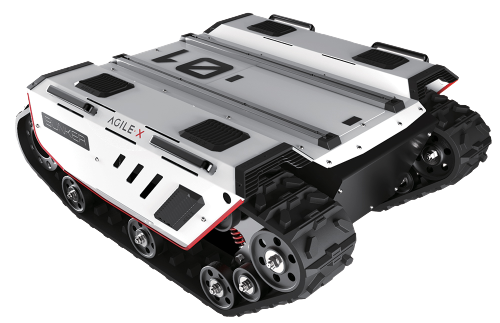

=============
AgileX BUNKER
=============

The AgileX BUNKER tracked differential drive platform is a high-performance outdoor all-terrain AGV
ready for the toughest challenges. Its two 650W brushless servo motors and six independent Christie
suspension mechanism allows BUNKER to surmount obstacles 170mm in height including stairs and
slopes up to 36°. Its 48V30Ah battery system provides 10km of range and speeds of 5km/h. The BUNKER
also has an optional battery upgrade to 48V60Ah and IP rating of IP54. BUNKER can carry payloads of
80kg and can turn in place. The BUNKER can be interfaced with external devices using a CAN
interface. C++ and ROS packages are available for further secondary development.

What's Here
===========

*   :doc:`getting_started` - These guides will walk you through the setup process for your BUNKER.
*   :doc:`operation` - These guides will details concepts related to the operation of the BUNKER.
*   :doc:`specifications` - Contains specification information for the BUNKER and related hardware.

Table of Contents:
==================

.. toctree::
    :maxdepth: 2
    :titlesonly:

    getting_started.rst
    operation.rst
    specifications.rst
